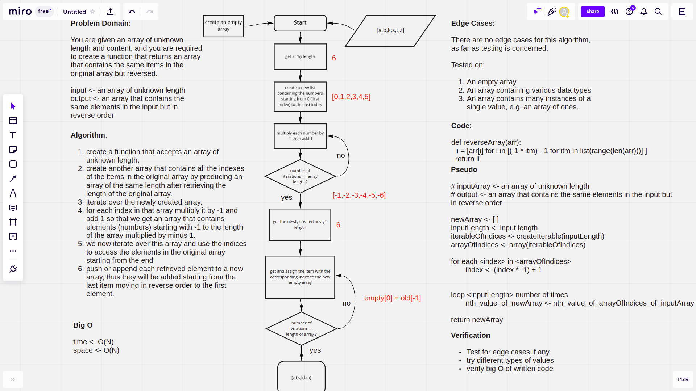

# Reverse an Array

The challenge requires defining a function that accepts an array of values regardless of thier types, and should return a new array that contains the same items in the original array but in reversed order.

## Whiteboard Process

## Approach & Efficiency

The approach I used is based on the fact that we can access elements in a Python list using nigative indices, so from that, I just produced a list containing the original indices for all of the elements and then stored them in a new list, `[0,1,2,...]`, then by iterating over this list and multipying each element with -1 and then adding +1 will result in a list that looks like this `[-1,-2,-3,...]`, so now we simply have a list that has elements representing the indices of a reversed array, we finally use iteration again in order to store the values from the original array in the new array due to the fact that we have the new indices and thier corresponding normal indices, so actually this array looks like this under the hood: `{"0" : "-1", "1" : "-2", ...}`, then we get the reversed list. 

As you can see, this method or algorithm just uses two for loops that are not nested inside of each other, but instead they are consecutive, following each other, so we can imply that the time and space complexity are grow linearly with the length of the input array, O(N).