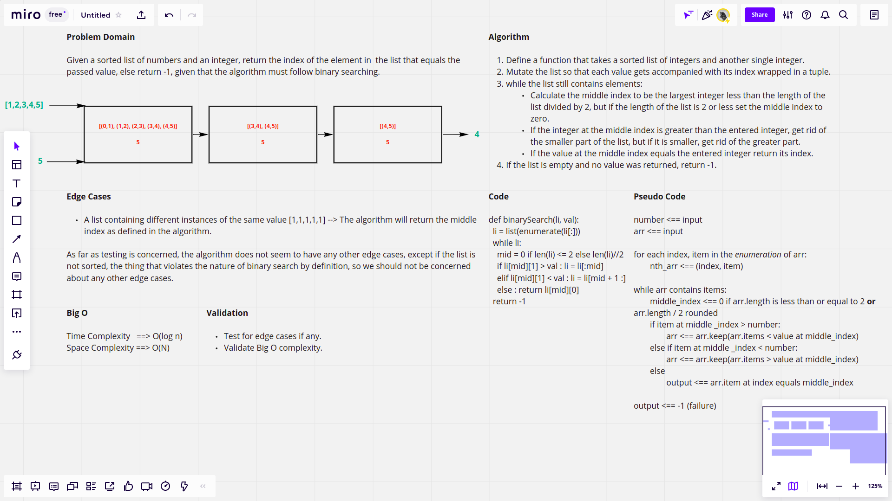

# Binary Search of Sorted Array

The challenge requires defining a function that accepts a sorted list and an integer, it should search in  a binary way for the value in this list that mathces the entered integer and then return its index.

## Whiteboard Process

## Approach & Efficiency

The algorithm follows an approach of first enumerating the list, that is, transforming each element in the list to a tuple of the index of the item and the itme itself. Then we enter a while loop, while the list still contains numbers and not empty, calculate the middle index to compare the number at that index with the passed number, then we check if the value at that index is greater than the passed number, if yes, we cut the half of the list that contains the greater numbers. The other case is if the value at the middle index is smaller than the passed number, if yes, we cut the half of the list that contains the smaller numbers, but if the value at the middle index equals the passed value, we just return its index. In case the list becomes empty and still no value was returned, this means that the search faild, and we return -1.
