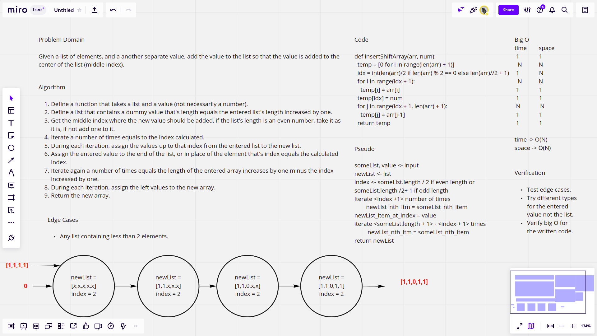

# Insert to Middle of an Array

The challenge requires defining a function that accepts a list of an unknown length and another single value, not necessarily a number, so that the value gets added to the middle index of the list without using any of the built in methods.

## Whiteboard Process

## Approach & Efficiency

The approach that I followed starts by generating a list that contains dummy values and its length is more than the entered list by one (has one more value), this is done by list comprehension which is a shorter way than writing explicit for loops. Then, we evaluate the middle index where the value will be added, basically we find the remainder if division of the length of the entered array and if it is zero then the index is just the length of the list divided by 2, but if it is not, we divide the length of the list by 2 and then we add 1. Next, we iterate over the first part of the newly created list, and we reassign the values just before the middle index the original values in the entered list. After this first loop, we assign the value to the new list in the middle index. Then we iterate again over the the rest of the new array and we assign the rest of the values, and we get the new list.

This function should not accept a list that contains less than two elements because this defies the logic of the function, and I have added this note to the whiteboard for reference, otherwise, all tests pass.
