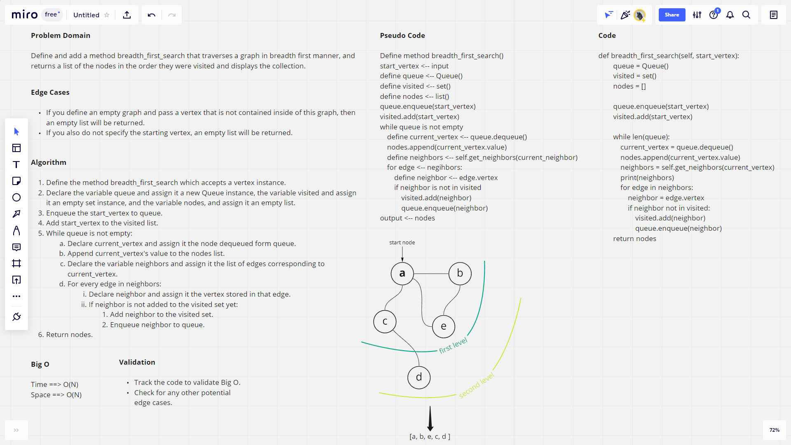

# Challenge Summary

The current challenge requires adding the breadth_first_search method to a graph class.

## Whiteboard Process



## Approach & Efficiency

The method defines three collection objects like a set, a list, and a queue, so we expect our space complexity to be O(N). The method basically keeps enqueueing the neighbors or the adjacent nodes of a node until all nodes are visited, so the time complexity at its worst is O(N) since we are visiting all of the nodes or vertices in the graph.

## Solution

```python
g = Graph()
a = g.add_node("a")
b = g.add_node("b")
c = g.add_node("C")
g.add_edge(a,b, weight=1)
g.add_edge(a,c, weight=1)
g.breadth_first_search(a) # ["a", "b", "c"]
```
