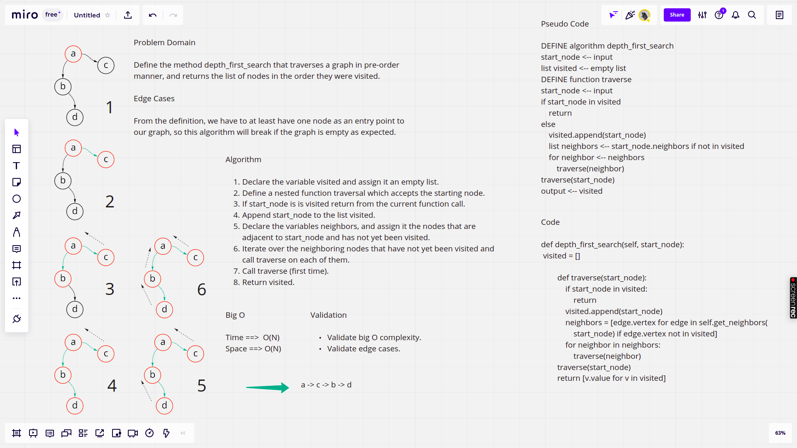

# Depth First Traversal

In depth first search we use a stack, which is in this algorithm is the call stack. What happens is that we push nodes to the stack, then we peek at the top node in the stack, and if the top node has unvisited children, we mark it as visited and then we push all its children that are not visited, then if the top node does not have any unvisited children, we pop that node.

## Pull Request

[Latest open pull request](https://github.com/HamzaAhmad97/data-structures-and-algorithms/pull/44).

## Challenge

The current challenge requires defining depth_first_search method and adding it to the Graph class. The method should accept a vertex as an entry point to the graph, and should return a list of the values of the nodes visited in the order they show up in depth first search.

## Approach & Efficiency

The approach utilizes recursion, is is similar to using a stack in a loop, but what happens is that we keep checking if the current vertex has been visited or not, and if not, we check its unvisited neighbors, and for unvisted one, we call the same traversal method on them until the method returns when it finds the last node that does not have any children that are not visited. Time cost is O(N) since we only pass over the nodes of graph, and the space complexity is O(N) considering the space taken by the call stack and the two lists defined in the method.

## Solution

