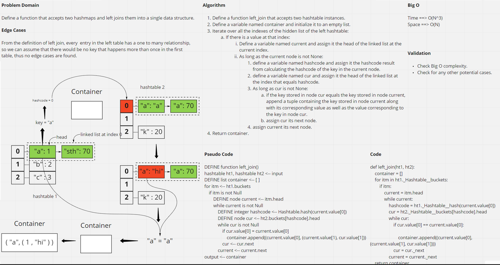

# Hashmap Left Join

## Pull Request

[Latest open pull requst](https://github.com/HamzaAhmad97/data-structures-and-algorithms/pull/40).

## Background

The SQL LEFT JOIN returns all rows from the left table, even if there are no matches in the right table. This means that if the ON clause matches 0 (zero) records in the right table; the join will still return a row in the result, but with NULL in each column from the right table.

This means that a left join returns all the values from the left table, plus matched values from the right table or NULL in case of no matching join predicate.

## Challenge

This challenge requires defining a function that accepts two hashtables and joins them using left join, and returns the result in a new list.

## Approach & Efficiency

The left_join function iterates once over the indexes of the left hashtable, and in each iteration, it iterates over the nodes in the linked lists found at each index, then for every node in those linked lists, it iterates over the nodes in the linked list found at the index in the right hashtable that is a result of hashing the key from the left key, so the worst case scenario is O(N^3) in terms of time.

When it comes to space, we only define an empty list that will hold all the joins or merges so we get O(N).

## Solution

