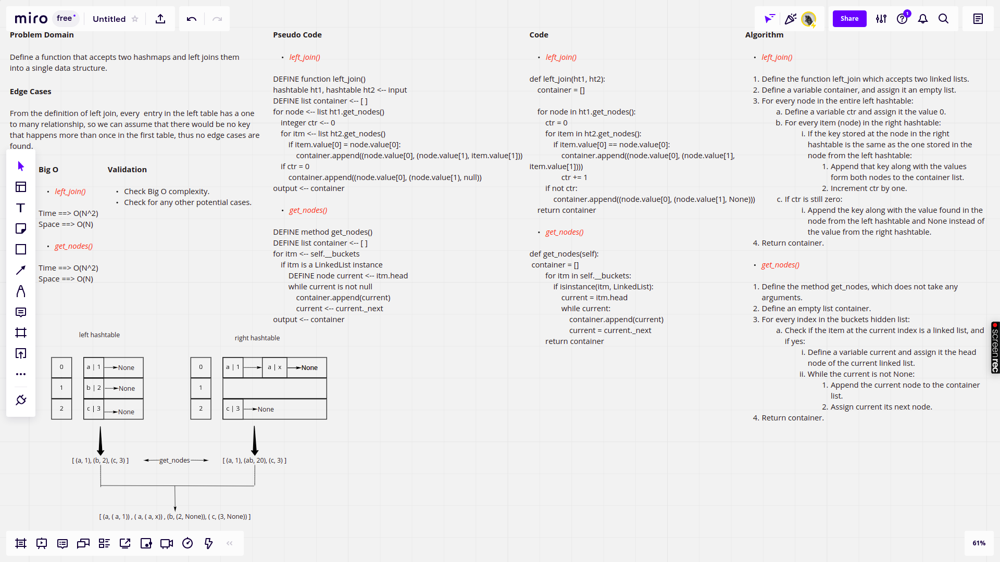

# Hashmap Left Join

## Pull Request

[Latest open pull requst](https://github.com/HamzaAhmad97/data-structures-and-algorithms/pull/40).

## Background

The SQL LEFT JOIN returns all rows from the left table, even if there are no matches in the right table. This means that if the ON clause matches 0 (zero) records in the right table; the join will still return a row in the result, but with NULL in each column from the right table.

This means that a left join returns all the values from the left table, plus matched values from the right table or NULL in case of no matching join predicate.

## Challenge

This challenge requires defining a function that accepts two hashtables and joins them using left join, and returns the result in a new list.

## Approach & Efficiency

The left_join funciton defines two for loops which basically iterate over the lists of nodes returned from the get_nodes method, and they define a list named contianer to hold the returned key/values pairs so the time complexity is O(N^2) and space complexity is O(N).

When it comes to the get_nodes method defined inside of the hashtable class, it iterates over the buckets list then iterates over the nodes found in each linked list, it also defines a list named container to hold the nodes found, so the time complexity is O(N^2), and space complexity is O(N).

## Solution

