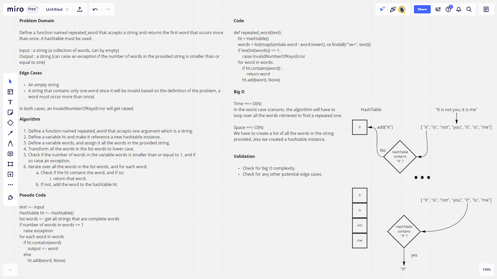

# Hashmap Repeated Word

## Pull Request

[Latest open pull request.](https://github.com/HamzaAhmad97/data-structures-and-algorithms/pull/38)

## Challenge Summary

This challenge requires defining a function repeated_word that accepts a string, extracts complete words in the string, and then returns the first word that occurs more than once.

## Whiteboard Process



## Approach & Efficiency

The function creates a hashtable in order to store key/value pairs in terms of the words found in the string passed to the function. The values are set to None. Then it creates a list that holds all the words in the passed string. After that it iterates over all the words in the list and checks if any of them is already contained in the hashmap, if so, it returns that word, if not, it adds the word to the hashmap.

Big O in regards to time is O(N) since in the worst case scenario we will have to iterate over all the words until we find a repeated word. Reagrding space, it is O(N) too since we create and add to a hashmap, as we also define a list that contains all the words in the passed string.

## Solution

```python
repeated_word("it is not me, it is you") # "it"
repeated_word("A is a") # "a"
repeated_word("nothing repeats here") # None
repeated_word("") # InvalidNumberOfKeysError
```
