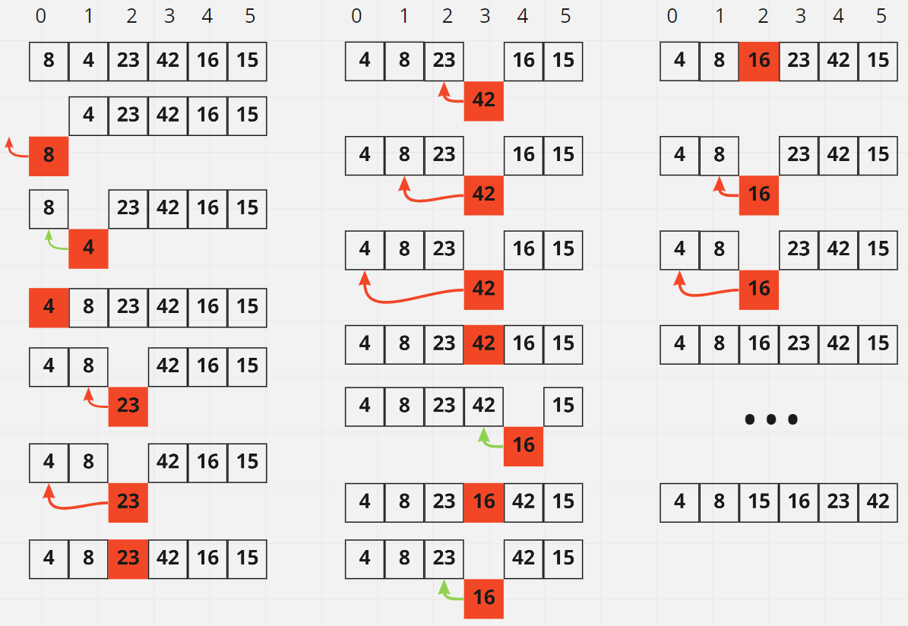

# Insertion Sort

[Latest open pull request](https://github.com/HamzaAhmad97/data-structures-and-algorithms/pull/35).

## Explanation and Discussion.

Consider that you were given a set of cards, and each card has a number written on it, the values themselves do not matter, then if I ask you to sort these cards, you will most probably start from either ends of the deck, you will hold the first card, then you will start looking on the rest of the cards in the deck in order. Say that the first card has 3 written on it, and the second one has 4 written on it, then the logical thing to do is to put the card that has 3 before the one that has 4 written on it. You then withdraw another card, assume it has 2 written on it, then you will probably start comparing 2 to the two cards you already withdrew, 2 is smaller than 4, so 2 goes before 4, then 2 is also smaller than 3, so 2 goes before 3, and this card becomes the first card in the new list. Notice the pattern here, you take a card, you check the number written on it, then you start comparing that number to the ones on the cards you already checked before, and this is basically how insertion sort works.

It is a simple algorithm, you most probably did it in your imagination even if you do not have an idea about this algorithm, it is relatively, simple, sometimes even trivial to the others, but you get the idea.

To get more technical, replace the deck of cards with a list or an array that only contains numbers (integers), and when we want to use insertion sort to sort the list or the array, we already know from the conceptual example, and from experience, that we will have to go over all the numbers in the list, we will compare each number we reach with the numbers put behind it also in order until we reach the beginning of the list.

Check out the illustration below to get a better idea about what I mean. We start with a list that contains the numbers 8,4,23,42,16,15, in this exact order, and we are required to sort this list. We are now at index 0, or in other words, the first position in the list, the number we encountered is 8, does it have any other numbers behind it? No, so we move to the next number which is 4. Now, we start asking ourselves again, does 4 have any other numbers behind it? Yes, we start comparing, is 4 smaller than 8? Well, yes, then what happens is that we move 8 to 4's position or index, and we move 4 to 8's position. We keep doing the same thing until we reach a number that is smaller than 4 then we stop, and 4 stays in that position and so on.

Now, if we check the pseudo code, we will notice that we start by defining a loop, a construct to allow us to do things a number of times, so here we want to iterate (loop) over all the items in the list. We start by defining a variable that will get assigned the index of the item before the current item, so for example, if we are now at 4, its index is 1, which means that J will be 0 which is the index of the number 8 just before the 4. But wait, we still did not do anything with the value J. Now we define another variable, and we call it (temp)orary, and we assign it the value corresponding to the current index, and since we are at index 0 which is stored in the iterator (looping variable) i, and i now is 1 since we are at 4, which means that temp will get assigned the value 4. So, to recap, so far we have j assigned the value 0, and temp assigned the value 4. Now, it is a new type of loops, a while loop, which is just like saying as long something is true, keep doing something else. So, here we want to check that as long or while the value of j is greater than or equal to 0 and the value of temp is smaller than the value in the list corresponding to the index that equals j which is 0 now, then we want to do something. Now j is indeed greater than equal to 0, and temp which is 4 is indeed smaller than the value before it which is 8, so now since all of this is true, then we will assign the item at position j +1 which is here i the value at index j which is here 8, which basically means that we moved 8 to 4's position, and now 4 is still stored in temp. Now, we decrement j by one, and assign it to itself, which means that j is now equals to -1, which also means that the condition will be false, and we are out of the while loop. The last step will be to assign the value held in temp to the position that lastly was not greater than 4, and we keep doing the same until we go through all the items in the list.

The result will be [ 4, 8, 15, 16, 23, 42 ].

## Passes 

.

## Code 

```python
def insertion_sort(li):
  for i in range(len(li)):
    j = i - 1 
    temp = li[i] 
    
    while j >= 0 and temp < li[j]:
      li[j + 1] = li[j] 
      j = j - 1 
      
    li[j + 1] = temp 
  return li
```

## Big O

* Space: O(1) 

    We do not actually create any other types of variables, we are just changing in place.

* Time: O(n^2)

    We iterate over all the elements, and each element gets compared to the ones behind it.
