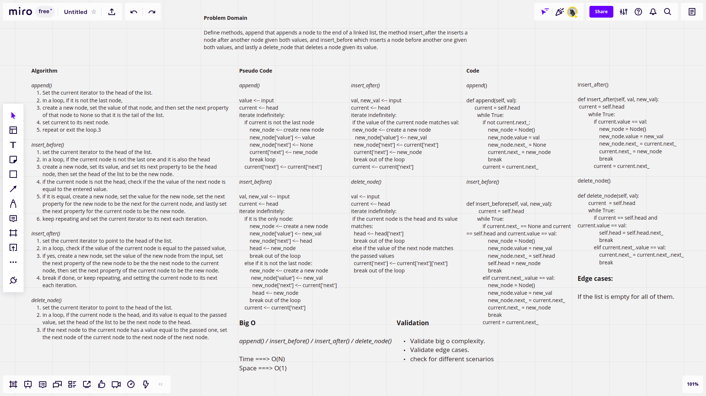
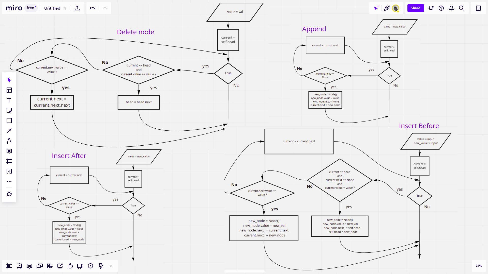

# Challenge Summary

This challenge requires you to append, insert_after, insert_before and the delete_node methods, to append a node to the end of a linked list, insert a node after another node given its value, insert a node before another node given its value, and delete a node given its value respectively.

## [Latest open pull request](https://github.com/HamzaAhmad97/data-structures-and-algorithms/pull/24)

## Whiteboard Process





## Approach & Efficiency

Each of the methods does not implement any sequencial data structures like lists, it is just a matter of removing assignments and reassigning again and so on that is why the space effeciency is O(1) for all of the methods, and the time effeciency is O(N) since we have to loop maximum N times assuming that the size of the input is N.

| Method    | Summary                                                                                 | Big O Time | Big O Space | Example             |
| :-------- | :-------------------------------------------------------------------------------------- | :--------: | :---------: | :------------------ |
| append    | add a new node to the end of a linked list                                                 |    O(N)    |    O(1)     | myList.append(99)   |
| insert_after  | insert a node after another node given its value                                    |    O(n)    |    O(1)     | myList.insert_after(80,99) |
| insert_before | insert a node before another node given its value                                   |    O(n)    |    O(1)     | myList.insert_before(80,99)  |
| delete_node | delete a node given its value                                                |    O(n)    |    O(1)     | myList.delete_node(99)  |

## Solution

```python
ll = LinkedList()
ll.insert('a')
ll.append('b') # a -> b -> Null
ll.insert_before('b','x') # a -> x -> b -> Null
ll.insert_after('a','z') # z -> a -> x -> b -> Null
ll.delete_node('a') # z -> x -> b -> Null
```
