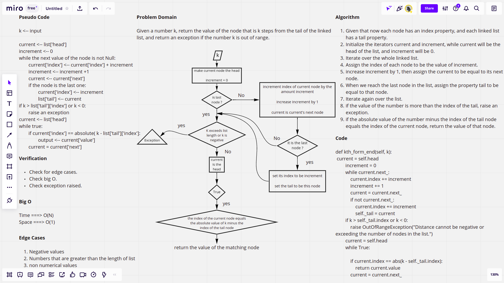

# Challenge Summary

This challenge requires defining a function that takes a number k, and based on that number return the value of the node that is k steps away from the last node in the linked list.

## [Latest open pull request](https://github.com/HamzaAhmad97/data-structures-and-algorithms/pull/25)

## Whiteboard Process



## Approach & Efficiency

The approach follows the idea of assigning each node an index, of course, this required adding an index property for each node, this also required adding a tail property for the linked list. The algorithm first loops over the linked list and sets the index for each node, and most importantly, at the end of the first loop, it assignes the tail property of the linked list to be the last node. After the first loop, the algorithm checks if the value of k is negative or if it exceeds the last index in the list, if yes it raises an exception, but if not, it moves to the next loop. In the second loop, we keep checking if the index of the iterator node is the one to be returend, if yes we return the value of that node.

* Time complexity: O(N)
* Space Complecity: O(1)

## Solution

```python
ll = LinkedList()
ll.insert("a")
ll.append("b")
ll.insert("c")
ll.kthFromIndex(0) # "b"
ll.kthFromIndex(60) # exception
```
