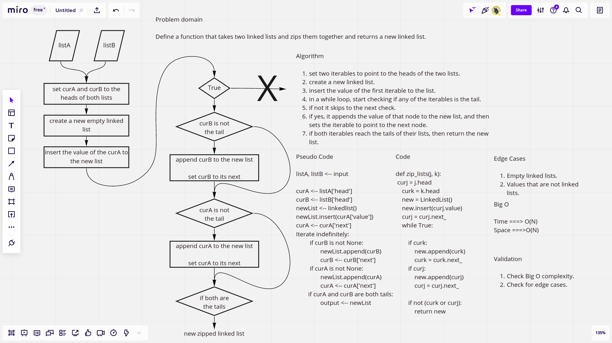

# Challenge Summary

This challenge requires defining a function that takes to linked lists and zips or combines them together returning a new linked list.

## [Latest open pull request]()

## Whiteboard Process



## Approach & Efficiency

The approach follows the idea that is similar to just appening new values to a linked list. It first sets two iterables ot the heads of the entered lists, then it inserts the value of the first list, and sets the iterable of the first list to its next node, then in a while loop, it checks if either of the iterables is the tail of thier lists, if no, it keeps appending them interchangeably, and once one of them is actually the tail of its list it will not append from it anymore, and will keep appending from the other list, but once both of them are the tails, the function terminates and returns the new list.

* Time complexity: O(N)
* Space Complecity: O(N)

## Solution

```python
ll = LinkedList()
ll.insert("a")
ll.insert("b")
ll.insert("c")
kk = LinkedList()
kk.insert("1")
kk.insert("2")
kk.insert("3")
zip_lists(ll,kk) # {c} -> {3} -> {b} -> {2} -> {a} -> {1} -> Null
```
