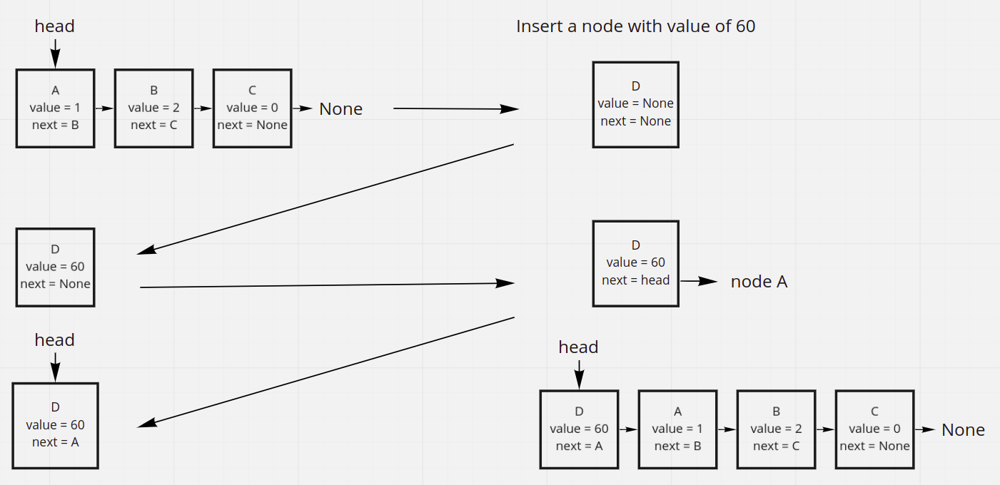
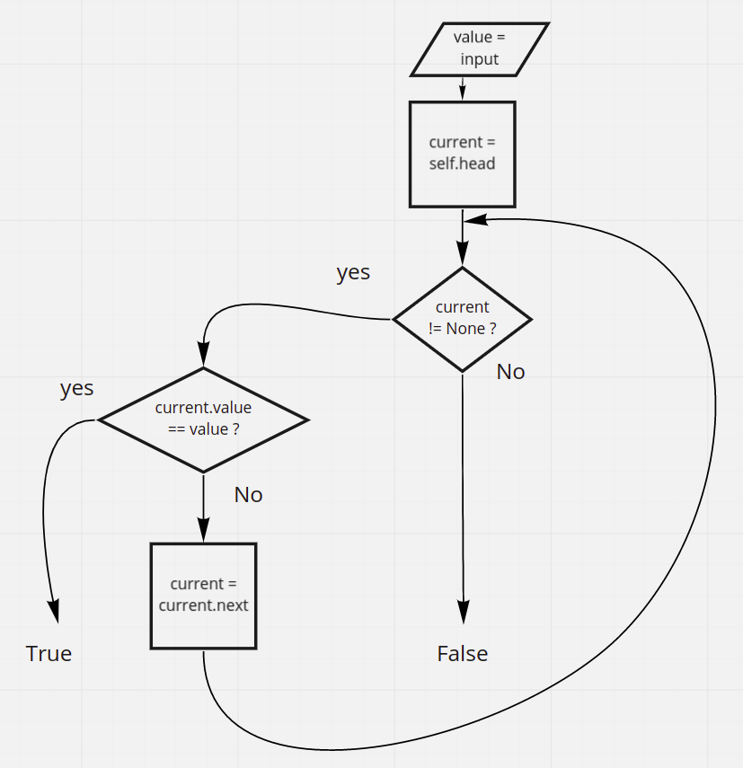
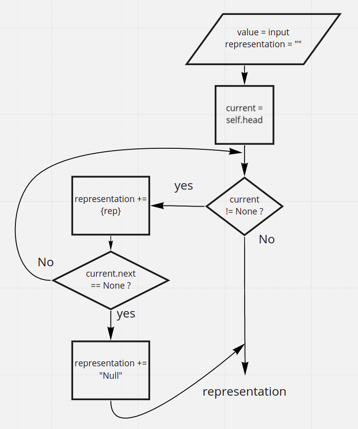

# Singly Linked List

Linked lists are a type of a data structure. A linked list consists of a number of nodes where each node is just a mere representation of something, given that each node must have a value attribute and a next attribute that holds a reference to the node after it in the sequence. There is the head attribute which holds a reference to the first node in the list. The next attirbute of the last node in the list does not hold any reference, thus its value is None. We can insert to linked lists, as we can check for a specific value within them.

## Link for the latest open pull request

[Latest open pull request](https://github.com/HamzaAhmad97/data-structures-and-algorithms/pull/22)

## Challenge

The challenge requires defining a class representing a linked list and another representing a node in the linked list. A node instance has to contain two attributes, the value for holding the data, and the next attribute which holds a reference to the next node.

The linked list class contains a method for inserting a node to the linked list given its value. The includes method takes also a value, and checks if there is a node that has a matching value. The to_string method should return a good representation of the linked list which reflects how many nodes it contains.

## Methods and thier efficiencies

Tried to choose the most efficient approach for each method. The methods are described in details in the next section.

| Method    | Summary                                                                                 | Big O Time | Big O Space | Example             |
| :-------- | :-------------------------------------------------------------------------------------- | :--------: | :---------: | :------------------ |
| Insert    | Adds a new `Node` to the `Linked List`                                                  |    O(1)    |    O(1)     | myList.insert(99)   |
| Includes  | Takes in a value and returns a boolean depending on if the value is in the `LinkedList` |    O(n)    |    O(1)     | myList.includes(99) |
| to_string | Prints the `Linked List` to the console                                                 |    O(n)    |    O(n)     | myList.to_string()  |

## API

### Insert method

The method takes one argument of any type which represetns the value of the new node. It creates a new Node instance, sets its value, and sets its next attribute to point to the head attribute, then it assigns the head attribute to point to that node.

### Includes method

This method takes one argument, which is the value we are going to search for in the linked list. It first creates an iterator and assigns it the head attribute, then in a while loop, while the current node is an actual Node instance or not None, if yes, check if the value of the current node equals the passed value, if yes, return True, if not assign current the value of the next property of itself so that is is now referencing the next node. If the loop terminates with the function still did not return, return False.

### To_String method

This method follows the same apprach as the inlcudes method, it creates a current variable, or an iterator, which starts with being equal to whatever in head, now while the current node is not equal to None, or if it is an actual node, take is value and add it to a string defined in the beginning, keep doing that until the last node, which will make "None" get passed to the end of the string and the method to terminate. The result should look like "{c} -> {b} -> Null".

