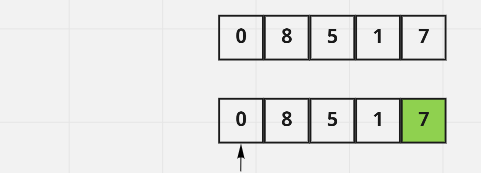
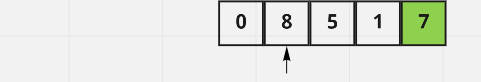
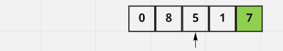
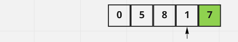
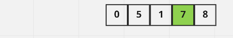
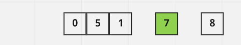
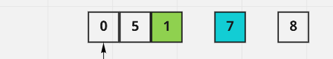
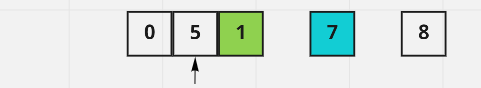
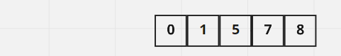

# Quick Sort Algorithm

## Pull Request

[Latest open pull request.](https://github.com/HamzaAhmad97/data-structures-and-algorithms/pull/36)

## About

Quick sort algorithm belongs to the divide and conquer class of algorithms. What happens is that we start with an array of integers, we select a pivot, ususally the last element in the list, then we start comparing each number starting from the leftmost one, if a number is smaller than the pivot, it gets swaped with the number before it. We keep doing the same thing until we divide the list into smaller and smaller lists such that the swapping is easier. Note that the pivot gets positioned in the exact right spot in the lits while we are sorting.

## Trace

### Pass 1:

We start by taking the element at the rightmost index as the pivot, which is 7 here. Now we start comparing the numbers starting with the first number in the array. Here it is 0, but since it is the first element, it stays in position.
    

    
### Pass 2:

Now we move to the next number which is 8 here, we compare 8 against 7, 8 is larger than 7, so no change also for 8.
    

### Pass 3:

The next number is now 5, and 5 is smaller than 7, so we swap 5 and 8, and 8 takes the position of 5, while 5 takes t's position.
    

    
### Pass 4:
    
The number is now 1, 1 is smaller than 7, so we swap between 1 and 8.

    
### Pass 5:

Now the previous pivot, which is 7, is positioned at the index that is directly after the last smaller number which is 1. The index of 1 is 2, so 7 will take the position of index 3.

    
### Pass 6:

Now we split or divide the array into two arrays, one contains the number smaller than the previous pivot, and the other contains the number that are larger than the pivot.

    
### Pass 7:

Now we repeat the same process for the array of the numbers that are smaller than the previous pivot. Here we take 1 which lies in the rightmost index. Since 0 is the first element in the array, it stays in position.
    

    
### Pass 8:
    
Since 5 is the last number to compare against, we swap between it and 7.

    
### Pass 9:

The rest are single element arrays, and now the array is sorted.
    

    
## Whiteboard
 

 
 
 
