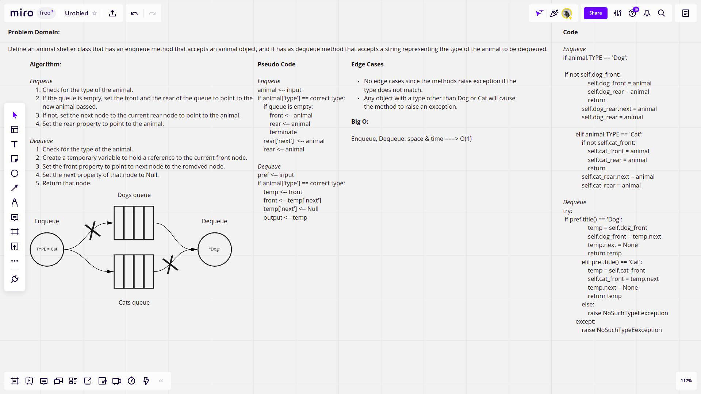

# Challenge Summary

This challenge requires defining an animal shelter class that accepts an animal object, which can be of type Cat or Dog. The animal shelter can enqueue an animal type object, as it also can dequeue the animal of the preference type if its queue is not empty, else it will throw an exception.

## [Latest Pull Request]()

## Whiteboard Process



## Approach & Efficiency

The enqueue and the dequeue methods defined in animal shelter are almost the same as the ones defined in a regular queue since in the animal shelter class, I defined a front and a rear objects for both the dog and the cat, then in the enqueue method when the use enqueues an animal, it will check for the type first and then it does the qneueing just like a normal enqueue method, and the same happens in the dequeue method where we check there for the type of the animal and if its correponding queue is empty or not, and if yes, it raises and exception. So, given that, the bit O for time and space for both methods is:

time & space for both enqueue and dequeue = O(1)

## Solution

```python
cat = Cat("Meme", 2)
dog = Dog("Coco", 3)
shelter = AnimalShelter()
shelter.enqueue(dog)
shelter.enqueue(cat)
shelter.dequeue('cat') # cat object meme
shelter.dequeue('dog') # dog object coco
```
