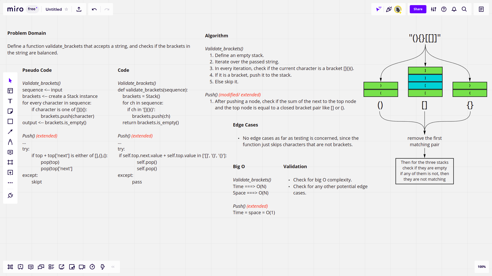

# Challenge Summary

This challenge requires defining a function called validate_brackets which accepts a string, and should check if the brackets in the string are balanced.

## [Latest Open Pull Request](https://github.com/HamzaAhmad97/data-structures-and-algorithms/pull/30)

## Whiteboard Process



## Approach & Efficiency

This function defines an empty stack instance every time it is called, then it iterates a number of times equals the length of the string passed. Then, in each iteration, it checks if the character is any of the brackets [](){}, then if yes, it will just push the bracket to the stack, and if not, it will just skip the character.

The `push()` method in the stack has been modified, since a try except block has been added, and in it, it will check if two consecutive brackets balance each other, and then if they do, they will both be popped out of the stack.

The `push()` method calls the `pop()` method, and both are of big O complexity of O(1) in terms of time and space, and since the function iterates a number of times equals the number of characters in the passed string, we assume that the big O compleixy will be O(N) in terms of time and space since in the function, a stack is defined, and assuming that we never find a matching pair, all brackets will be pushed to the stack, so O(N) also in terms of space.

## Solution

```python

sequence = '()[[Extra Characters]]'
validate_brackets(sequence) # True
```
