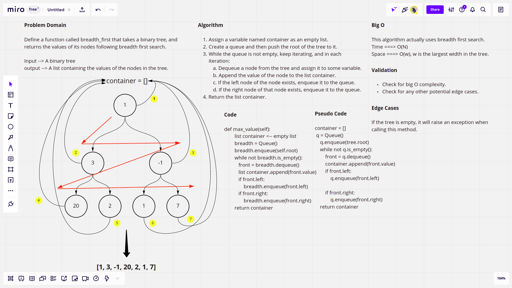

# Challenge Summary
This challenge requires defining a function `breadth_first()` that accepts a binary tree, and returns a list containing the values of the nodes of the tree following breadth first search.

## [Latest Open Pull Request](https://github.com/HamzaAhmad97/data-structures-and-algorithms/pull/33)

## Whiteboard Process



## Approach & Efficiency

The approach actually uses breadth first search which is considered one of the most effecient searching algorithms, where the space complexity is O(W) where w is the maximum depth of the tree, and the time complexity is O(N).

## Solution

```python
bt = BinarySearchTree(*[1,4,5,6,2])
breadth_first(bt) # [1,4,5,6,2] 
# In fact the function follows the same approach as the max_value function defined in the previous challenge since I actually used breadth first search also to add the nodes, so the result is expected to be in the same order as the input

```
