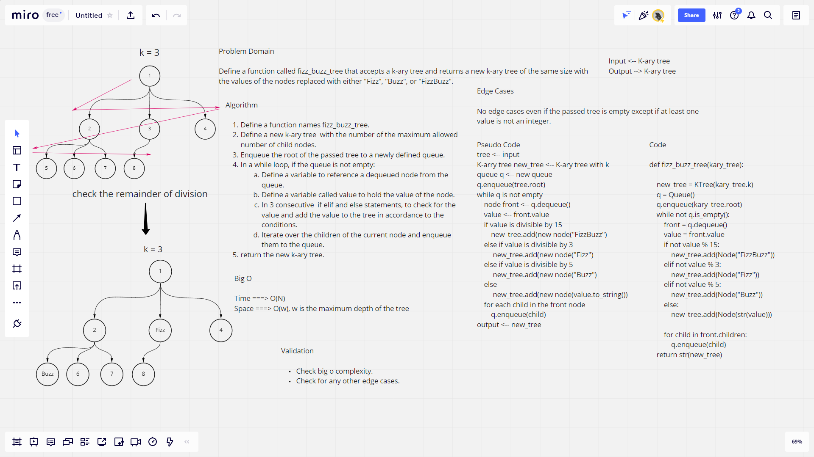

# Challenge Summary

Define a function called fizz_buzz_tree that accepts a k-ary tree and returns a new k-ary tree of the same size with the values of the nodes replaced with either "Fizz", "Buzz", or "FizzBuzz".

## Whiteboard Process



## Approach & Efficiency

The approach follows the breadth first search method so it traverses each level at a time, and the time complexity is O(N), while the space complexity is O(w) and w is the maximum depth of the tree.

## Solution

```python
kt = KTree(3,1,2,3,4,5,6)
print(fizz_buzz_tree(kt)) # 1 | 2 | Fizz | 4 | Buzz | Fizz
```
