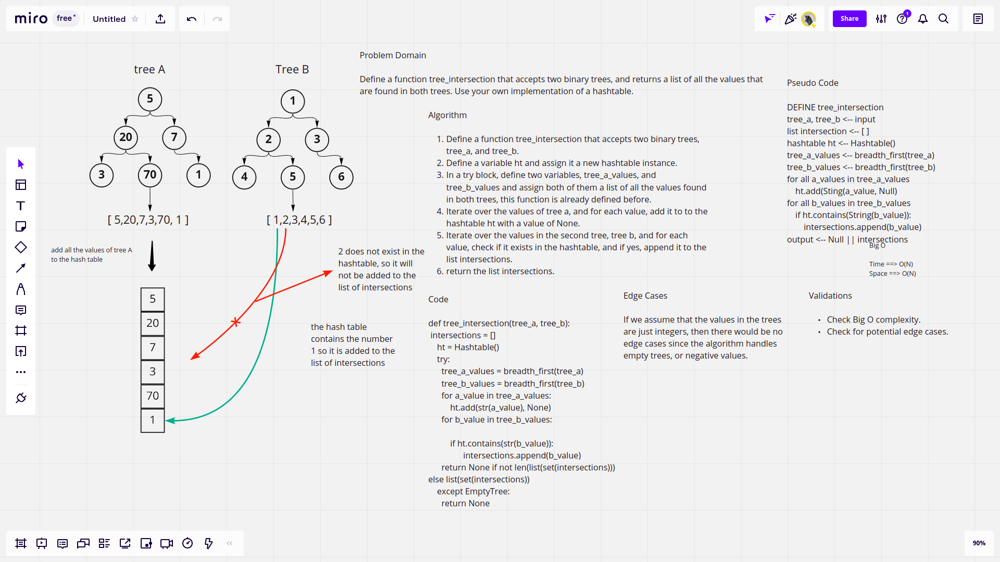

# Tree Intersection 

## Pull Request.

[Latest open pull requset.](https://github.com/HamzaAhmad97/data-structures-and-algorithms/pull/39)

## Challenge Summary

This challenge requires defining a function tree_intersection that accepts two binary trees, and returns a list of the values that are found in both trees. A hashtable must be used.

## Whiteboard Process



## Approach & Efficiency

The algorithm defines an empty list and a new hashtable instance at the beginning, it then defines two lists tow store the values found in both trees via breadth first algorithm, then it iterates over these two lists in order, so the time complexity is O(N), and the space complexity is O(N).

## Solution

```python
tree_a = BinarySearchTree(1,2,3)
tree_b = BinarySearchTree(1,5,6)
tree_intersection(tree_a, tree_b) # [1]
```
