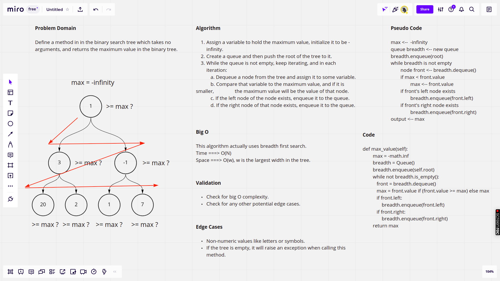

# Challenge Summary

This challenge requires defining a method called `max_value()` that does not accept any arguments and should return the maximum value in a binary tree.


## [Latest Open Pull Request](https://github.com/HamzaAhmad97/data-structures-and-algorithms/pull/32)

## Whiteboard Process



## Approach & Efficiency

The approach actually uses breadth first search which is considered one of the most effecient searching algorithms, where the space complexity is O(W) where w is the maximum depth of the tree, and the time complexity is O(N).

## Solution

```python
bt = BinarySearchTree(*[1,2,3,5,6])
bt.max_value() # 6

```
